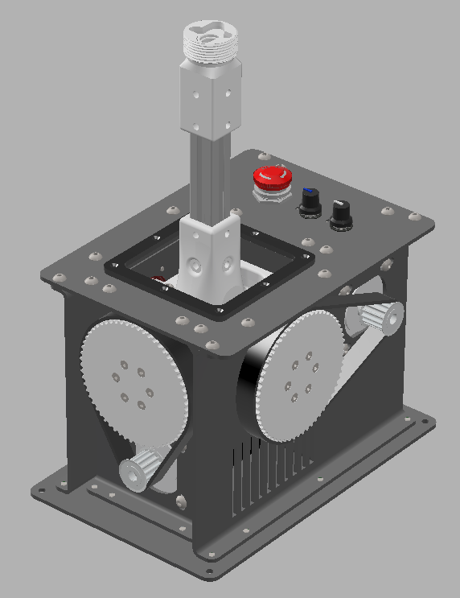

# VPForceKit-ffb-joystick-base WIP
This project contains CAD files necessary for the mechanical assembly of a base of the VPForce kit (2x57BLF03 + USB kit).
It is currently only a prototype that I will develop further for my own FFB base.

# IMPORTANT INFORMATION
The only thing modified for 86BLF04 Motors are the sheet metal parts. The 3D Model isn't (yet) updated.

 

3d-print-parts - all elements which need to be printed  
sheet-metal-parts - drawings for case parts, including holes and bending profiles  
assembly - full STP assembly

